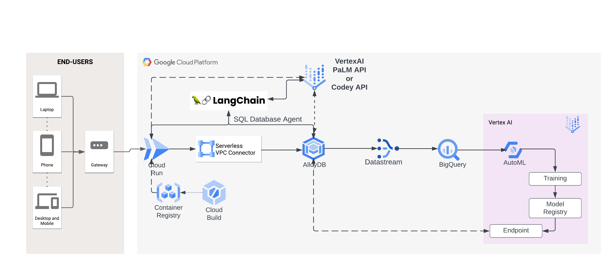

# Alloydb_vertexai_integration
Used car selling platform hosted on AlloyDB integrated with VertexAI for online price prediction model along with GenAI capabilities for insights.

Following type of prompts can be used:

* Find the car along with km_driven of year 2018 with the lowest km driven and highest mileage
* Find the name of the top 5 car after 2018 and has less than 50000 km driven
* Generate a table of the count of cars based on fuel type after 2015
* Generate a Bar graph of cars with fuel as column and count of cars as data values
* Generate a bar chart of cars with year as column and count of cars as data values

# Architecture


# Deploying Steps
1. Create a AlloyDB Instance: https://cloud.google.com/alloydb/docs/instance-primary-create
2. Create a VM instance: https://cloud.google.com/compute/docs/instances/create-start-instance

     => SSH on VM instance
   
     => Deploy AllowDB Auth proxy: https://cloud.google.com/alloydb/docs/auth-proxy/connect
   
     => Install python dependencies
      ```shell
      pip install streamlit
      pip install pandasql
      pip install langchain
      pip install google-cloud-aiplatform
      pip install google-cloud-alloydb-connector[pg8000]
      pip install asyncpg
      pip install pgvector
      ```
